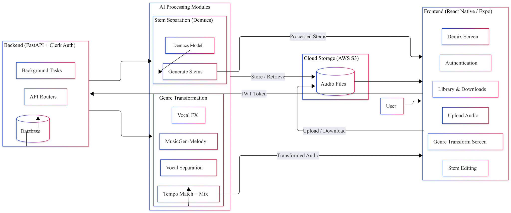

# VibeShift — AI Music Transformation App

> **Final Year Project (FYP-2)** — A full-stack AI-powered mobile app for music genre transformation and stem demixing, built with React Native (Expo) and FastAPI.

---

## Demo

### Demo 1 — App Flow, Design & User Settings
> Login/signup, home screen, dark/light mode, theme customization, profile editing, password update, library view

<!-- PLACEHOLDER: Replace with your screen recording embed -->
**[▶ Watch Demo 1 — App Flow & Design](#)**
`// TODO: Upload screen-recording-1.mp4 to repo or YouTube and replace link above`

---

### Demo 2 — Stem Demixing
> Tap a previous demix card to resume it, go back, upload a new song, view separated vocals & instruments, adjust stem volumes, raise vocal pitch, play the custom mix

<!-- PLACEHOLDER: Replace with your screen recording embed -->
**[▶ Watch Demo 2 — Full Demixing Flow](#)**
`// TODO: Upload screen-recording-2.mp4 to repo or YouTube and replace link above`

---

### Demo 3 — Genre Transformation
> Open genre transform tab, upload a song, select a genre, set duration/offset/guidance sliders, submit, wait for processing, play the transformed output

<!-- PLACEHOLDER: Replace with your screen recording embed -->
**[▶ Watch Demo 3 — Genre Transform Flow](#)**
`// TODO: Upload screen-recording-3.mp4 to repo or YouTube and replace link above`

---

## Features

| Feature | Description |
|---|---|
| **Genre Transform** | Upload any song, pick a genre (Blues/Jazz/Rock/etc.), get an AI-generated version powered by MusicGen |
| **Stem Demixing** | Separate any song into vocals, drums, bass, and other stems using Demucs |
| **Stem Mixer** | Adjust individual stem volumes, pitch-shift vocals, and play a custom mix in real time |
| **Playback** | Seekable audio progress bar for original and transformed tracks |
| **Library** | Browse all past transformation and demix jobs with status badges |
| **Resume Jobs** | Tap any library card to instantly resume the result screen for that job |
| **Authentication** | Secure login/signup via Clerk (email + OAuth) |
| **Themes** | Light/dark mode + multiple color accent themes |
| **Profile** | Edit name, bio, audio quality preference, export format, password |
| **Delete Jobs** | Remove any past job and its S3 files permanently |

---

## Tech Stack

### Frontend
- **React Native** (Expo SDK 51, Expo Router)
- **TypeScript**
- **Clerk Expo** — authentication
- **expo-av** — audio playback
- **expo-document-picker** — file selection
- **expo-linear-gradient**, **expo-blur** — UI polish

### Backend
- **FastAPI** (Python 3.10+)
- **SQLModel + SQLite** — local database
- **Clerk JWT** — token verification with JWKS
- **AWS S3** — audio file storage (uploads, stems, outputs)
- **Replicate API** — Demucs (stem separation) + MusicGen melody-conditioned generation
- **librosa, soundfile, scipy** — audio processing (vocal FX, tempo matching, mixing)

---

## Architecture



---

## Project Structure

```
fyp_project/
├── notebooks/
│   └── mixer_notebook.ipynb # Colab FastAPI server: stem pitch/volume editing + mixing
├── backend/
│   ├── main.py              # FastAPI app, startup JWKS warmup
│   ├── auth.py              # Clerk JWT verification (PyJWKClient)
│   ├── database.py          # SQLModel schema: User, DemixJob, TransformJob
│   ├── storage.py           # AWS S3 upload/download/delete/presign
│   ├── replicate_client.py  # Async Replicate client: call_demucs, call_musicgen
│   ├── migrate.py           # DB migration utility (add columns)
│   ├── requirements.txt     # Python dependencies
│   └── routers/
│       ├── users.py         # GET/PATCH /users/me, profile + settings
│       ├── demixer.py       # POST/GET/DELETE /demixer/jobs
│       ├── transform.py     # POST/GET/DELETE /transform/jobs
│       └── library.py       # GET /library (all jobs, unified)
│
└── frontend/VibeShift/
    ├── app/
    │   ├── (tabs)/
    │   │   ├── index.tsx           # Home tab
    │   │   ├── genre-transform.tsx # Genre transform tab
    │   │   ├── demixing.tsx        # Demixing tab wrapper
    │   │   ├── library.tsx         # Library tab
    │   │   └── profile.tsx         # Profile tab
    │   ├── demixing.tsx            # Full demixing screen
    │   ├── genre-transform.tsx     # Full genre transform screen (4-phase)
    │   ├── login.tsx               # Auth screen
    │   ├── appearance.tsx          # Theme picker
    │   ├── settings.tsx            # Settings hub
    │   ├── edit-profile.tsx
    │   ├── audio-preferences.tsx
    │   └── change-password.tsx
    ├── components/
    │   ├── SimpleAudioBar.tsx   # Seekable playback bar (expo-av)
    │   ├── StemMixer.tsx        # Per-stem volume + pitch controls
    │   ├── StemRing.tsx         # Animated stem visualizer
    │   ├── BottomTabBar.tsx     # Custom tab navigator
    │   ├── SongCard.tsx         # Library/history card
    │   ├── Icon.tsx             # Unified icon wrapper
    │   └── ...
    ├── context/
    │   ├── AppearanceContext.tsx # Theme state (light/dark/accent)
    │   └── UserContext.tsx       # Clerk user + profile sync
    ├── utils/
    │   └── TransformResume.ts   # Module singleton for cross-tab navigation
    └── constants/
        └── theme.ts
```

---

## Setup

### Prerequisites
- Python 3.10+
- Node.js 18+
- Expo Go app on your phone (or iOS Simulator / Android Emulator)
- [Clerk](https://clerk.com) account (free tier works)
- [Replicate](https://replicate.com) account
- AWS account with an S3 bucket

---

### Backend Setup

```bash
cd backend

# Create and activate virtual environment
python -m venv venv
# Windows:
venv\Scripts\activate
# Mac/Linux:
source venv/bin/activate

# Install dependencies
pip install -r requirements.txt
```

Create `backend/.env` (never commit this file):
```env
CLERK_ISSUER=https://your-clerk-domain.clerk.accounts.dev
CLERK_JWKS_URL=https://your-clerk-domain.clerk.accounts.dev/.well-known/jwks.json

AWS_ACCESS_KEY_ID=your-aws-access-key
AWS_SECRET_ACCESS_KEY=your-aws-secret-key
AWS_REGION=us-east-1
S3_BUCKET_NAME=your-bucket-name

REPLICATE_API_TOKEN=your-replicate-token
```

Run the server:
```bash
uvicorn main:app --host 0.0.0.0 --port 8001 --reload
```

The API will be available at `http://localhost:8001`. Interactive docs at `http://localhost:8001/docs`.

---

### Frontend Setup

```bash
cd frontend/VibeShift
npm install
```

Create `frontend/VibeShift/.env` (never commit this file):
```env
EXPO_PUBLIC_CLERK_PUBLISHABLE_KEY=pk_test_your-clerk-publishable-key
EXPO_PUBLIC_API_URL=http://YOUR_LOCAL_IP:8001
```

> **Note:** Use your machine's local network IP (e.g. `192.168.1.x`), not `localhost`, so your phone can reach the backend over WiFi.

Start the app:
```bash
npx expo start
```

Scan the QR code with **Expo Go** (Android) or the Camera app (iOS).

---

## API Reference

All endpoints require `Authorization: Bearer <clerk_token>` except where noted.

| Method | Endpoint | Description |
|--------|----------|-------------|
| POST | `/auth/sync` | Sync Clerk user to local DB on first login |
| GET | `/users/me` | Get current user profile |
| PATCH | `/users/me` | Update name, bio, audio quality, export format |
| GET | `/transform/genres` | List all 10 available genre presets |
| POST | `/transform/jobs` | Upload audio and start genre transformation |
| GET | `/transform/jobs/{id}` | Poll job status + get download URL when done |
| DELETE | `/transform/jobs/{id}` | Delete job and all its S3 files |
| POST | `/demixer/jobs` | Upload audio and start stem demixing |
| GET | `/demixer/jobs/{id}` | Poll demix status + get stem URLs |
| DELETE | `/demixer/jobs/{id}` | Delete demix job and all its S3 files |
| GET | `/library` | Get all jobs (demix + transform) for current user |

---

## Genre Transform Pipeline

```
1. Upload audio → stored in S3
        ↓
2. Replicate Demucs (htdemucs)
   → vocals stem + drums + bass + other
        ↓
3. Mix non-vocal stems → instrumental track
        ↓
4. Replicate MusicGen (melody-conditioned)
   → genre-converted instrumental
        ↓
5. Vocal FX (genre-specific: EQ, distortion, reverb, delay)
        ↓
6. Tempo-match vocals to new instrumental (librosa)
        ↓
7. Final mix + peak normalization → upload to S3
        ↓
8. Job status → "completed", download URL returned
```

### Supported Genres
`blues` · `classical` · `country` · `disco` · `hiphop` · `jazz` · `metal` · `pop` · `reggae` · `rock`


---

## Stem Mixer — Colab API

The **Stem Mixer** feature (adjusting stem volumes, pitch-shifting vocals, muting stems, and playing a custom mix) requires a separate processing server because pitch shifting and audio mixing are compute-heavy operations not suited for the main FastAPI backend.

This is handled by **[notebooks/mixer_notebook.ipynb](notebooks/mixer_notebook.ipynb)** — a FastAPI server that runs inside Google Colab and is exposed publicly via ngrok.

### How It Works

```
User edits stems in the app (volume, pitch, mute toggles)
        ↓
App sends stem S3 URLs + per-stem settings to Colab API
        ↓
Colab downloads each stem, applies edits:
  - Pitch shift   (librosa pitch_shift, up to ±12 semitones)
  - Timbre adjust (HPSS harmonic/percussive separation)
  - Volume scale  (linear gain per stem)
  - Mute          (skipped entirely)
        ↓
All unmuted stems summed → peak normalized → WAV returned
        ↓
App plays the mixed result via SimpleAudioBar
```

### Colab API Endpoints

| Method | Endpoint | Description |
|--------|----------|-------------|
| GET | `/health` | Check the server is alive |
| POST | `/process-and-mix` | Main endpoint — process + mix all stems in one call |
| POST | `/process-stem` | Process a single stem (pitch, timbre, volume) |
| POST | `/mix-stems` | Mix a set of already-processed stem URLs |

### `/process-and-mix` Payload

The app sends a JSON array of stem configs:

```json
[
  { "url": "https://s3.../vocals.wav",  "pitch": 2,  "timbre": 1.0, "volume": 1.2, "muted": false },
  { "url": "https://s3.../drums.wav",   "pitch": 0,  "timbre": 1.0, "volume": 1.0, "muted": false },
  { "url": "https://s3.../bass.wav",    "pitch": 0,  "timbre": 1.0, "volume": 0.8, "muted": false },
  { "url": "https://s3.../other.wav",   "pitch": 0,  "timbre": 1.0, "volume": 1.0, "muted": true  }
]
```

Returns a mixed `.wav` file ready for playback.

### Running the Colab Server

1. Open `notebooks/mixer_notebook.ipynb` in [Google Colab](https://colab.research.google.com)
2. Set your ngrok auth token in the notebook (cell 6)
3. Run all cells — the server starts on port `8001` and ngrok prints a public URL
4. Copy that URL into `backend/.env` as `COLAB_API_URL=https://your-ngrok-url.ngrok-free.dev`
5. Restart the FastAPI backend — the demixer router will forward mix requests to Colab

> The Colab notebook must stay running while using the Stem Mixer. Free Colab sessions time out after ~12 hours of inactivity.

---

## Deployment

See [AWS_DEPLOYMENT_GUIDE.md](AWS_DEPLOYMENT_GUIDE.md) for full deployment steps.

**Architecture summary:**
- **Backend:** FastAPI on any VPS / EC2 (no GPU required — all AI runs on Replicate)
- **Storage:** AWS S3 for all audio files (uploads, stems, outputs)
- **Auth:** Clerk (fully hosted)
- **AI inference:** Replicate API (pay-per-run, serverless)

---

## Team

| Name | Role |
|---|---|
| Insiya Fakhruddin | Full-stack development (FYP-2) |
| Mehreen Saghar | Collaborator |

---

**Status:** Complete & Working  
**Last Updated:** May 2026  
**Python:** 3.10+ · **Expo SDK:** 51 · **FastAPI:** 0.110+
